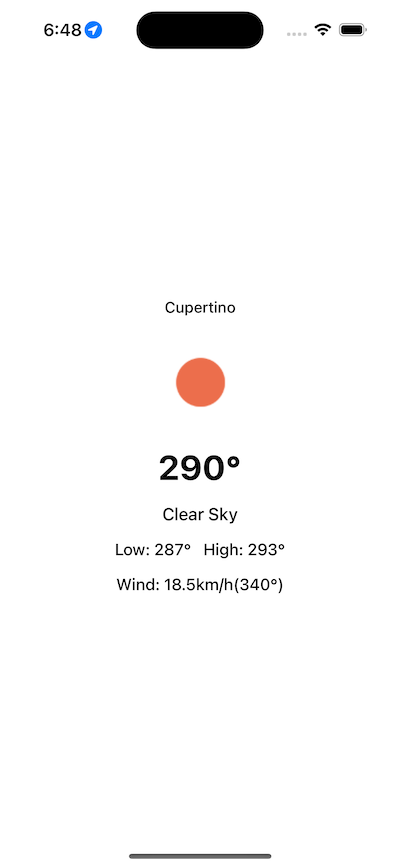
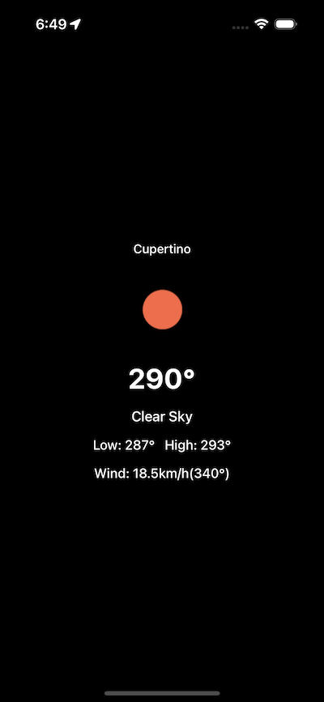

# Weather App 🌡️

 

## General approach and considerations
* 100% Swift, using two external dependencies: [SnapKit][snp] and [Kingfisher][kf], added as Swift Packages.
* Dark mode ready.
* Used protocol oriented programming, preferring composition over inheritance where possible.

## Patterns
* Define `APIResource`s to specify a reachable data resource.
* Define a simple network layer by using a `RequestPerformer` responsible to fetch the data, specified by the routers.
* Model decoding done after the data is fetched.
* Define `APIClient` to sum the functionalities of API resources creation and requests execution.
* A simple `ViewModel` is defined to contain the API client, along with the proper data transformation and organization, according to the view requirements. All `CLLocation` support and handling is done in there as well.
* The `ViewController` is the binding place between states updates sent from the `ViewModel`, passed to the `View` **and** user events coming from the `View` to trigger actions on the `ViewModel`.
* I used a simple dependency injection pattern by properties, to pass the required data where needed.

## Dependencies
* Used [SnapKit][snp] to simplify the auto layout setup.
* Used [Kingfisher][kf] to simplify the current weather icon loading.

## Model Layer
* I used `Struct`s to handle immutable data.
* Simple `Decodable` support.

## View Layer
* All UI done by code.
* Simple `View`s configuration definitions that are injected to the view instances to update the interfaces.

## Unit Tests
* Add unit tests for request performing and decoding using mock resources only.

## Current Pitfalls
**Note:** There are several pitfalls in the implementation, here I can list some:
* More robust test coverage, including network calls.
* Add weather icon placeholder.
* Missing launch image.
* UI tests.
* Better permissions handling.

Maybe I am missing something else, but this is what I could do with the available time I had.

Thank you for the opportunity!

## About

Author: [**Victor Soto**][vs]

Last Revision: 25-02-2024

[vs]: https://www.victorso.to
[snp]: https://github.com/SnapKit/SnapKit
[kf]: https://github.com/onevcat/Kingfisher
